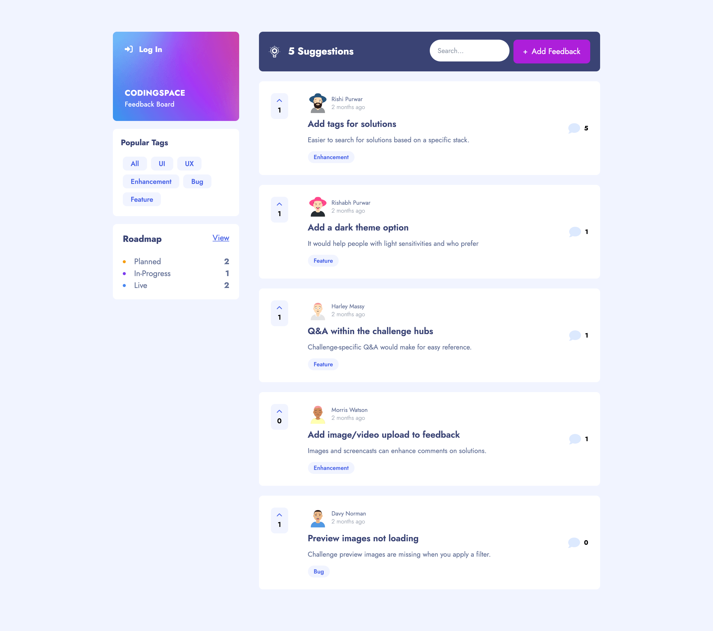

## CODINGSPACE Feedback App

CodingSpace Feedback App is an Open Source platform where everyone can give their feedback to improve the platform, suggest new features and report bugs.

## Features

✅ Create, read, update, and delete product feedback requests\
✅ Receive form validations when trying to create/edit feedback requests\
✅ Filter suggestions by category\
✅Add comments to a product feedback request\
✅ Upvote product feedback requests\

## 👨‍💻 Demo

Try out the website : [Product Feedback App](https://codingspace-feedback-app.vercel.app/feedbacks)

## 👨‍🔧 Tech Stack

